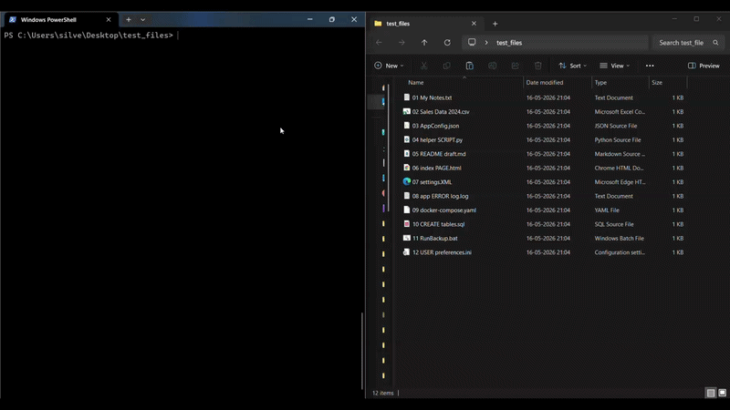

# 🗂️ rnmtool - File Rename Utility
> A powerful, **zero-dependency**, cross-platform CLI for batch renaming files - with a safe dry-run preview.




```bash
pipx install rnmtool
```

> Works on **Windows, macOS, and Linux** - invoke from any folder, any terminal.

---

## ✨ Why rnmtool?

| Feature | rnmtool | Manual renaming | PowerShell scripts |
|---|---|---|---|
| Safe dry-run preview | ✅ | ❌ | ❌ |
| Regex support | ✅ | ❌ | ⚠️ complex |
| Zero dependencies | ✅ | - | ✅ |
| Works on Win / Mac / Linux | ✅ | ❌ | ❌ |
| One-word invocation | ✅ | ❌ | ❌ |
| Glob file filtering | ✅ | ❌ | ⚠️ complex |
| Recursive directory support | ✅ | ❌ | ⚠️ complex |

---

## 📋 Table of Contents

- [Installation](#installation)
- [Quick Start](#quick-start)
- [All Options](#all-options)
- [Tutorials](#tutorials)
  - [1. Dry-Run Preview](#1-dry-run-preview)
  - [2. Add a Prefix](#2-add-a-prefix)
  - [3. Add a Suffix](#3-add-a-suffix)
  - [4. Find & Replace Text](#4-find--replace-text)
  - [5. Regex Find & Replace](#5-regex-find--replace)
  - [6. Convert Case](#6-convert-case)
  - [7. Change File Extension](#7-change-file-extension)
  - [8. Filter by Glob Pattern](#8-filter-by-glob-pattern)
  - [9. Recursive Renaming](#9-recursive-renaming)
  - [10. Combine Multiple Transformations](#10-combine-multiple-transformations)
- [Test Files](#test-files)
- [Contributing](#contributing)
- [Safety Notes](#safety-notes)

---

## Installation

### Recommended: `pipx` (cross-platform, isolated)

```bash
pipx install rnmtool
```

> Don't have pipx? Install it first: `pip install pipx`

### Alternative: `pip`

```bash
pip install rnmtool
```

### One-command installer scripts

**Windows (PowerShell):**
```powershell
irm https://raw.githubusercontent.com/AayushGoswami/rnmtool/main/scripts/install.ps1 | iex
```

**Linux / macOS (Bash):**
```bash
curl -fsSL https://raw.githubusercontent.com/AayushGoswami/rnmtool/main/scripts/install.sh | bash
```

### Verify installation

```bash
rnmtool --help
```

---

## Quick Start

```bash
# Always preview first - no files are changed
rnmtool test_files --dry-run --find " " --replace "_"

# If the preview looks good, apply (remove --dry-run)
rnmtool test_files --find " " --replace "_"

# Run from inside the target folder (no directory argument needed)
cd /path/to/my/folder
rnmtool --dry-run --case lower
```

---

## All Options

```
usage: rnmtool [-h] [--pattern GLOB] [--recursive] [--dry-run] [--overwrite]
               [--find TEXT] [--replace TEXT] [--regex] [--prefix TEXT]
               [--suffix TEXT] [--ext EXT] [--case {lower,upper,title}]
               [directory]
```

### Positional Arguments

| Argument    | Description                               | Default              |
|-------------|-------------------------------------------|----------------------|
| `directory` | The folder containing files to rename     | `.` (current folder) |

### General Options

| Flag             | Short | Description                                             |
|------------------|-------|---------------------------------------------------------|
| `--pattern GLOB` | `-p`  | Only rename files matching this glob (e.g. `"*.txt"`)  |
| `--recursive`    | `-r`  | Search subdirectories recursively                       |
| `--dry-run`      | `-n`  | Preview changes without modifying any file              |
| `--overwrite`    |       | Allow overwriting a file if the new name already exists |
| `--help`         | `-h`  | Show help message and exit                              |

### Transformation Options

| Flag             | Short | Description                                              |
|------------------|-------|----------------------------------------------------------|
| `--find TEXT`    | `-f`  | Text (or regex pattern) to search for in filenames       |
| `--replace TEXT` | `-s`  | Replacement text (default: empty - deletes the match)    |
| `--regex`        | `-x`  | Treat `--find` as a regular expression                   |
| `--prefix TEXT`  |       | Text to prepend to every filename                        |
| `--suffix TEXT`  |       | Text to append to every filename (before the extension)  |
| `--ext EXT`      |       | Replace the file extension (e.g. `.jpg` or `jpg`)        |
| `--case`         | `-c`  | Convert case: `lower`, `upper`, or `title`               |

> **Transformation order:** find/replace → case → prefix/suffix → extension

---

## Tutorials

All examples below use the included `test_files/` folder.
**Always run with `--dry-run` first to preview changes safely.**

---

### 1. Dry-Run Preview

Preview what *would* happen without touching any file.
A ✓ mark appears next to filenames that would be changed.

```bash
rnmtool test_files --dry-run --case lower
```

**Preview output:**
```
  BEFORE                        AFTER
  ────────────────────────────  ────────────────────────
  04 helper SCRIPT.py           04 helper script.py   ✓
  07 settings.XML               07 settings.xml       ✓
  12 USER preferences.ini       12 user preferences.ini ✓
```

No files are modified. Remove `--dry-run` to apply changes.

---

### 2. Add a Prefix

Prepend a label or date to every filename in a folder.

```bash
# Dry-run first
rnmtool test_files --dry-run --prefix "2025_"

# Apply
rnmtool test_files --prefix "2025_"
```

**Result:**
```
01 My Notes.txt          →  2025_01 My Notes.txt
02 Sales Data 2024.csv   →  2025_02 Sales Data 2024.csv
03 AppConfig.json        →  2025_03 AppConfig.json
```

**Tip:** Combine with `--pattern` to prefix only specific file types:
```bash
rnmtool test_files --pattern "*.csv" --prefix "report_"
```

---

### 3. Add a Suffix

Append a label to every filename (inserted *before* the extension).

```bash
# Dry-run first
rnmtool test_files --dry-run --suffix "_backup"

# Apply
rnmtool test_files --suffix "_backup"
```

**Result:**
```
01 My Notes.txt        →  01 My Notes_backup.txt
05 README draft.md     →  05 README draft_backup.md
11 RunBackup.bat       →  11 RunBackup_backup.bat
```

---

### 4. Find & Replace Text

Replace any text string inside filenames - spaces, words, anything.

#### Example A - Replace spaces with underscores

```bash
rnmtool test_files --dry-run --find " " --replace "_"
rnmtool test_files --find " " --replace "_"
```

**Result:**
```
01 My Notes.txt          →  01_My_Notes.txt
02 Sales Data 2024.csv   →  02_Sales_Data_2024.csv
08 app ERROR log.log     →  08_app_ERROR_log.log
```

#### Example B - Remove a specific word

```bash
rnmtool test_files --find " draft" --replace ""
```

**Result:**
```
05 README draft.md   →  05 README.md
```

#### Example C - Replace a word with another

```bash
rnmtool test_files --find "ERROR" --replace "error"
```

**Result:**
```
08 app ERROR log.log   →  08 app error log.log
```

---

### 5. Regex Find & Replace

Use regular expressions for advanced pattern-based renaming.
Enable with the `--regex` (or `-x`) flag alongside `--find`.

#### Example A - Strip leading numbers from filenames

```bash
rnmtool test_files --dry-run --regex --find "^\d+\s"
rnmtool test_files --regex --find "^\d+\s"
```

**Result:**
```
01 My Notes.txt        →  My Notes.txt
02 Sales Data 2024.csv →  Sales Data 2024.csv
03 AppConfig.json      →  AppConfig.json
```

#### Example B - Remove all digits from filenames

```bash
rnmtool test_files --regex --find "\d+" --replace ""
```

#### Example C - Replace multiple spaces with a single underscore

```bash
rnmtool test_files --regex --find "\s+" --replace "_"
```

---

### 6. Convert Case

```bash
# Lowercase
rnmtool test_files --case lower

# Uppercase
rnmtool test_files --case upper

# Title Case
rnmtool test_files --case title
```

**Title case result:**
```
08 app ERROR log.log   →  08 App Error Log.log
10 CREATE tables.sql   →  10 Create Tables.sql
```

---

### 7. Change File Extension

#### Normalize `.XML` to `.xml`

```bash
rnmtool test_files --pattern "*.XML" --ext .xml
```

#### Convert `.yaml` to `.yml`

```bash
rnmtool test_files --pattern "*.yaml" --ext .yml
```

#### Change `.txt` to `.md`

```bash
rnmtool test_files --pattern "*.txt" --ext .md
```

> The leading dot is optional: `--ext yml` and `--ext .yml` both work.

---

### 8. Filter by Glob Pattern

```bash
# Only .log files
rnmtool test_files --pattern "*.log" --prefix "archived_"

# Files starting with "0"
rnmtool test_files --pattern "0*" --case lower

# Only .json files
rnmtool test_files --pattern "*.json" --suffix "_v2"
```

---

### 9. Recursive Renaming

```bash
# Rename all .txt files in test_files and any subfolders
rnmtool test_files --recursive --pattern "*.txt" --case lower

# Always dry-run first with recursive!
rnmtool test_files --recursive --dry-run --find " " --replace "_"
```

---

### 10. Combine Multiple Transformations

Transformations are applied in order: **find/replace → case → prefix/suffix → extension**

#### Clean up all filenames at once

```bash
rnmtool test_files --find " " --replace "_" --case lower --prefix "2025_"
```

**Result:**
```
01 My Notes.txt         →  2025_01_my_notes.txt
08 app ERROR log.log    →  2025_08_app_error_log.log
12 USER preferences.ini →  2025_12_user_preferences.ini
```

#### Strip numbers, title-case, add suffix

```bash
rnmtool test_files --regex --find "^\d+\s" --case title --suffix "_final"
```

#### Pattern-scoped multi-transform

```bash
rnmtool test_files --pattern "*.py" --case lower --prefix "script_"
```

---

## Test Files

A `test_files/` folder is included with 12 dummy files of varied types to safely experiment:

| File | Extension |
|------|-----------|
| `01 My Notes.txt` | `.txt` |
| `02 Sales Data 2024.csv` | `.csv` |
| `03 AppConfig.json` | `.json` |
| `04 helper SCRIPT.py` | `.py` |
| `05 README draft.md` | `.md` |
| `06 index PAGE.html` | `.html` |
| `07 settings.XML` | `.XML` |
| `08 app ERROR log.log` | `.log` |
| `09 docker-compose.yaml` | `.yaml` |
| `10 CREATE tables.sql` | `.sql` |
| `11 RunBackup.bat` | `.bat` |
| `12 USER preferences.ini` | `.ini` |

---

## Contributing

Contributions are welcome! Please read [CONTRIBUTING.md](CONTRIBUTING.md) for guidelines.

- 🐛 [Report a bug](https://github.com/AayushGoswami/rnmtool/issues)
- 💡 [Request a feature](https://github.com/AayushGoswami/rnmtool/issues)
- 📖 [Read the changelog](CHANGELOG.md)

---

## Safety Notes

- ✅ **Always use `--dry-run` before applying any changes.**
- ✅ Files whose names are unchanged by a transformation are automatically skipped.
- ⚠️ If a rename would cause a **name collision**, the tool skips that file and warns you. Use `--overwrite` only if you are sure.
- ⚠️ **Recursive mode** (`--recursive`) can affect many files. Always dry-run first.
- ℹ️ The tool only renames files - it **never moves, deletes, or modifies file contents.**

---

*Built with Python's standard library - zero dependencies. Works on Windows, macOS, and Linux.*
